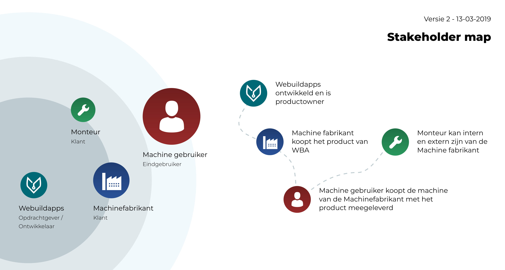

# Fase 1.2 - Gebruikers

## Fase 1.2 - Problemen en journey van Stakeholders in kaart brengen

### Onderzoeksvragen

Ik heb de volgende onderzoeksvragen gesteld binnen deze fase:

1. Wat is de huidige flow van de gebruiker en stakeholder
2. Wat is de gewenste flow van de gebruiker en stakeholder
3. Wie zijn mijn stakeholders  _\(meegenomen uit Fase 1.1 na het niet volledig beantwoorden van de onderzoeksvraag\)_

### Onderzoeksmethodes

Ik wil tijdens deze fase de volgende onderzoeksmethodes toepassen:

1. Participant observation / Be the user
2. Fly on the wall / Bezoek
3. Interviews met medewerkers

### Deliverables

1. Customer journeys \(huidige flow\)
2. Customer journeys \(Gewenste flow\)
3. Persona's

## Intro onderzoeksmethodes

### Be the storingsmonteur



Ik heb een dag meegelopen met een storing bezoek. Ik ben meegelopen bij het bedrijf Connection Systems het is een bedrijf die op locatie tijdelijke camera's ophangen. Denk aan verkeersonderzoeken, evenementen en festivals. Deze camera's vallen regelmatig in storing door internetverbindingen, weersomstandigheden en software fouten.

Na de de meeloop dag heb ik nog een interview gehouden met de monteur. Het interview vond plaats bij de monteur thuis. Mijn doel met het interview was om vragen te beantwoorden die ik niet had gezien met mijn dag meelopen.

**Verbeteringen** In het interview werden verschillende problemen benoemd. Allereerst in een storing oproep voor een monteur nooit prettig, dit omdat de monteur die storingsdienst heeft thuis wacht op storingen. Problemen waar verbeteringen op kunnen worden gevonden zijn:

* Er is veel communicatie tussen de monteur en storingsmanager \(iemand op kantoor die op afstand kijkt of de storing is opgelost in het systeem\)
* Er zijn veel gegevens nodig voor de monteur: Exacte en nauwkeurige locatie van de machines, contactpersonen, bijlages en modeltypes.

### Fly on the wall bij de boer 

De Fly on the wall vond plaats bij de boer in de schuur en buiten op het land. Mijn doel met het bezoek was om te kijken tegen welke problemen de boer aanloopt bij het bewaken van zijn machines en producten. En welke acties ze uitvoeren voor het oplossen van hun storingen/problemen.

**Bewaken van storingen** Vaak is de boer of personeel aanwezig bij een machines. Dit is niet altijd het geval, met als gevolg dat ze er te laat achter komen dat een machine ermee op houdt. Dit geeft schade met zich mee dat productie verloren kan gaan en de planning in de war loopt.

**Acties bij een storing** De boer heeft zelf wel kennis om bouten aan te draaien maar de meeste machines zijn tegenwoordig te ingewikkeld om zelf ermee aan de slag te gaan. Ze hebben contactgegevens van monteurs die ze kunnen bellen. Zij komen ongeveer 1/2 na telefoon om de machine te repareren. Dit kost veel tijd en geld. 

### Gesprek met machinefabrikant

Het interview vond plaats bij de machinefabrikant. Mijn doel met het interview/bezoek was om te kijken wat de mogelijkheden zijn van de machines \(Functies en meetbare data doormiddel van sensoren\) en welke beperkingen ze hebben.

**Mogelijkheden** zijn beantwoord met Documentatie van sensoren en doeleindes van machines.

Sensorren: [https://docs.google.com/spreadsheets/d/1uU9cTRq27iQW\_U-oReHoTXottZ337LAFgzUyTILTnOk/edit\#gid=1170885446](https://docs.google.com/spreadsheets/d/1uU9cTRq27iQW_U-oReHoTXottZ337LAFgzUyTILTnOk/edit#gid=1170885446)​





**Beperkingen** werden niet besproken bij het interview, dit kwam doordat we vooral keken naar de mogelijkheden van de machines. Er zijn wel drie beperkingen benoemd:

* Machines zijn in verschillende variaties van handmatig, semi automatisch tot volledig automatisch. 
* De machines zijn vaak custom naar de klant zijn wensen toe. Daarom is er niet een vast aantal functionaliteiten en sensoren bij elke machine.
* Machines werken vaak samen met machines van andere partijen. \( Zie "Manter - Communicatie tussen equipment" document hieronder, dit is een van hun partners waar ze vaak hun machines naast hebben staan.\)



## Uitkomst onderzoeksmethodes

### Huidige flows Storingen

#### Gebruiker - Productie

#### Gebruiker - Analytisch 

#### Monteur 

### Huidige flows Monitoring

#### Gebruiker - Productie

#### Gebruiker - Analytisch

#### Storingsmanager

### Persona's


**Onderzoeksvraag 3: Wie zijn mijn stakeholders**


#### Productie

#### Analytisch

#### Monteur

#### Machinefabrikant

### Stakeholder map V2

## Inzichten

### Huidige flow van de stakeholders


**Onderzoeksvraag 1: Wat is de huidige flow van de gebruiker en stakeholder**

_Zie flows in het proces hierboven voor gedetailleerde informatie._


#### **Storing - Productie**

1. Als ze de storing in de gaten hebben is het al te laat.
2. Na het repareren blijft of verhoogt de stress.
3. Verantwoordelijkheid ligt voornamelijk bij de leidinggevende.
4. Monteur moet gebeld worden en krijgt geen informatie van het systeem.

#### Storing - Analytisch

1. Informatie van meldingen zijn niet duidelijk over prioriteit
2. Monteur moet gebeld worden en krijgt wel informatie van het systeem
3. Ervaring wordt tijdens de productiestop al positiever door contact met de monteur. omdat hij weet dat het nu opgelost gaat worden.

#### Storing - Monteur

1. Veel contact op afstand tussen de storingmanager en monteur.
2. Er wordt media verstuurd tussen storingmanager en monteur.
3. Monteur heeft een lijstje aan gegevens nodig om naar de storing te gaan.

#### Monitoring - Productie

1. Monitoring vind alleen plaats op locatie van de machine
2. Niet alle data is leesbaar die gemeten wordt. dit kom omdat de bedieningspaneel soms niet eens een scherm heeft.
3. Communicatie over data van de machine gebeurd regelmatig via de telefoon. bijvoorbeeld als de leidinggevende niet op locatie is.

####  Monitoring - Analyse

1. Opent zelden zijn monitorplatform
2. Inlog proces is niet gebruiksvriendelijk

#### Monitoring - Storingmanager

1. Contact naar monteur gaat via de hand. en niet rechtstreeks vanuit het systeem.
2. Het proces van meldingen binnenkrijgen is voldoende geoptimaliseerd.

### Toekomstige flow van stakeholders


**Onderzoeksvraag 2: Wat is de gewenste flow van de gebruiker en stakeholder**


#### Productie

1. Monitoring van statussen en weergeven van data moet plaats kunnen vinden op alle locaties
2. Meer data moet worden laten zien aan de gebruiker. Dit moet in periodieke grafieken worden laten zien. 
3. Storingen moeten worden voorspelt door middel van \(verandering in\) data.
4. Storing wordt automatisch doorgegeven aan de monteur en dit moet worden terug gekoppeld aan de app gebruiker.
5. Storingen moet worden aangegeven aan de leidinggevende.

#### Analytisch

1. Inlogproces makkelijk maken
2. Duidelijke notificaties geven over storingen

#### Monteur en storingmanger

1. Informatie over klant, storing en machine moet via het systeem worden verstuurd door volledige informatie te hebben van de klant.
2. Notities van onderhoud kunnen opslaan en inlezen van vorige storingen.
3. Logboek van alle fouten die daarvoor zijn geweest en misschien zelf zijn opgelost door de klant.

### \*\*\*\*

### 

