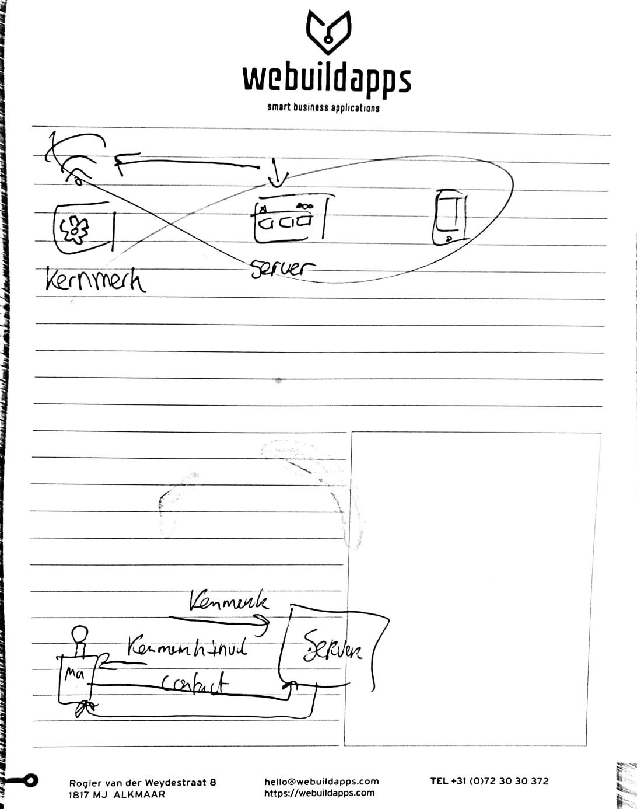
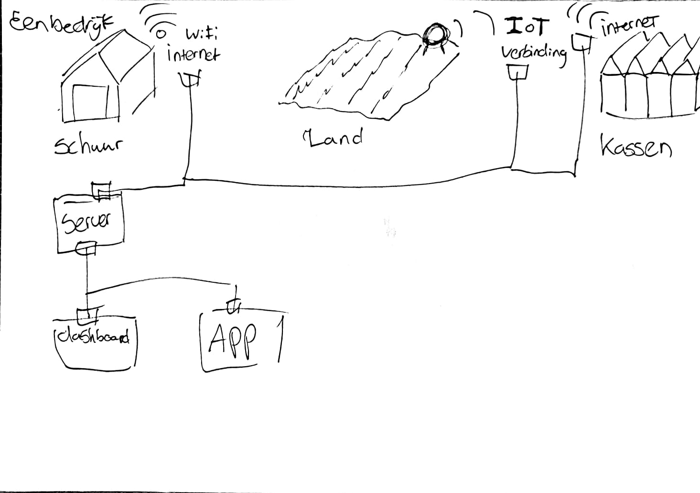
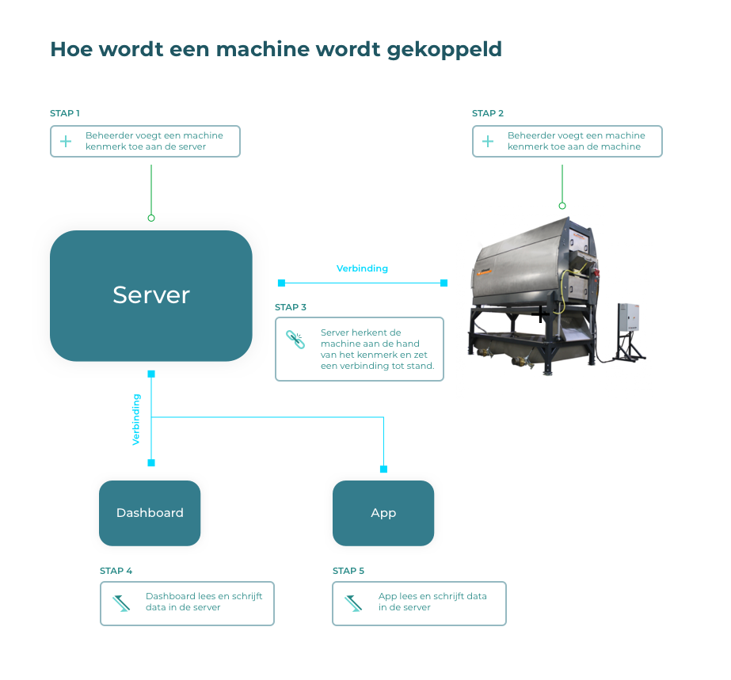

# Fase 1.3 - Technisch

## Fase 1.3 - Technische taken in kaart brengen

### Onderzoeksvragen

Ik heb de volgende onderzoeksvragen gesteld binnen deze fase:

1. Welke storingen kunnen er plaats vinden bij machines die ik gebruik in mijn ontwerp?
2. Welke functies hebben de machines die ik gebruik in mijn ontwerp?
3. Hoe wordt de koppeling gemaakt tussen machines en het platform?

### Onderzoeksmethodes

Ik wil tijdens deze fase de volgende onderzoeksmethodes toepassen:

1. Expert review
2. Desk research
3. Interview

### Deliverables

1. Task analyse

## Onderzoek voor Task analyse

### Taskanalyse

In fase 1.2 heb ik verschillende documentatie gekregen van de machines. Deze heb ik samengevat in een document. 







Hierin is schematisch zichtbaar hoe een:

1. Allround Vegetable Processing Uien productie lijn is opgebouwd. Welke sensoren er in zitten en welke data zij meten.
2. Allround Storage koelcel is opgebouwd. Welke sensoren er in zitten, welke sensoren er in zitten en welke data zij meten. Ook wordt er weergegeven welke storingen er kunnen plaats vinden
3. Crodeon harspel sensoren bevat en welke storingen er kunnen plaatsvinden.

Van de Allround Vegetable processing worden geen storingen weergegeven dit is helemaal afhankelijk wat de klant wilt hebben. Maar in mijn ontwerpen kan ik uitgaan van: Aan en Uit. 



### Expert review

Ik ben gaan zitten met een expert met de vragen: 

1. Hoe worden machines gekoppeld aan het platform? 
2. Hoe worden worden een bedrijfsnetwerken gekoppeld?

### Feedback feezy

Tijdens deze presentatie heb ik de volgende feedback punten ontvangen:

* Mijn verhaal is niet duidelijk genoeg voor mensen die geen verstand van de agrarische markt hebben. Ik moet meer een verhaal schetsen vanuit een boer met afbeeldingen, voorbeelden en video.



## Inzichten

### Taskanalyse


**Onderzoeksvraag 1: Welke storingen kunnen er plaats vinden bij machines die ik gebruik in mijn ontwerp?**



**Onderzoeksvraag 2: Welke functies hebben de machines die ik gebruik in mijn ontwerp?**


Bekijk het PDF document "Taskanalyse Storingen en sensoren" hierboven.

### Expert review


**Onderzoeksvraag 3: Hoe wordt de koppeling gemaakt tussen machines en het platform?**


1. De fabrikant heeft een kenmerk toegevoegd aan de machine en deze wordt gekoppeld aan het internet bij installatie bij de klant.
2. Het netwerk van de locatie waar de machine is aan verbonden wordt een verbinding gekoppeld aan de server van het platform.
3. Een beheerder in het systeem zal het kernmerk van de machine \(Stap 1\) toevoegen aan het dashboard. Zo weet de server welke machines in het systeem moeten worden opgenomen.

