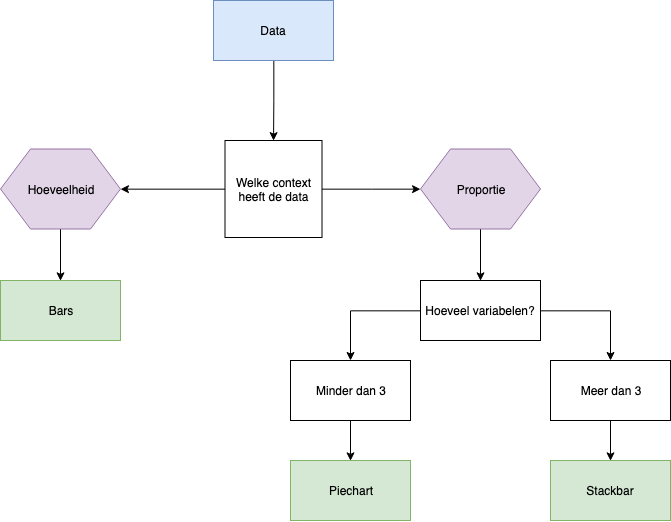
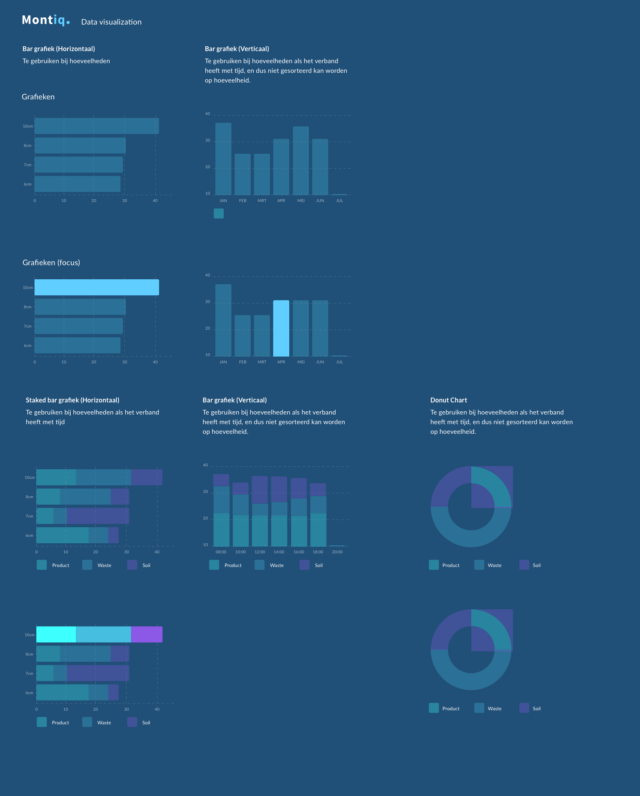
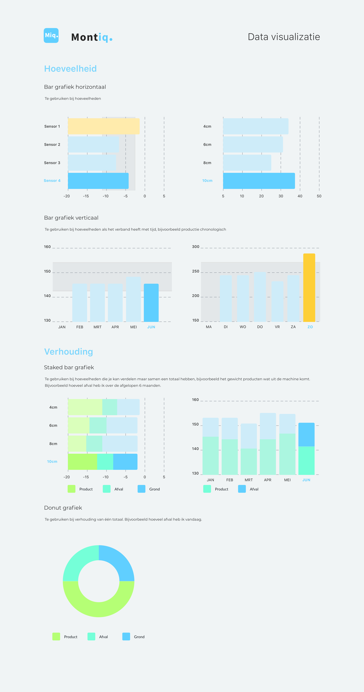

# Fase 1.4 - Data Visualisatie

## Intro

### Onderzoeksvragen

Ik heb de volgende onderzoeksvragen gesteld binnen deze fase:

1. Hoe kun je deze data op een schaalbare wijze tonen?
2. Welke soorten data types zijn er?
3. Aan welke eisen moet de data voldoen?
4. Welke soorten grafieken zijn er?
5. Waar moet ik rekening mee houden in het ontwerpen van grafieken?

### Bronnen:

Wilke, C. O. \(2019\). Fundamentals of Data Visualization: A Primer on Making Informative and Compelling Figures. Sebastopol, CA: O'Reilly Media, Incorporated.

Raamstijn. \(2018, 30 maart\). LSS: Meetniveaus \(continue vs discrete data\). Geraadpleegd op 8 mei 2019, van [http://www.raamstijn.nl/eenblogjeom/index.php/lean-six-sigma/3436-lss-soorten-variabelen-data](http://www.raamstijn.nl/eenblogjeom/index.php/lean-six-sigma/3436-lss-soorten-variabelen-data)

## Data weergeven op een schaalbare wijze

> "One problem we commonly encounter with vertical bars is that the labels identifying each bar take up a lot of horizontal space. … The better solution for long labels is usually to swap the x and y axes, so that the bars run horizontally." \(Wilke, 2019\)


**Designkeuze: Door kleine ruimtes gebruik maken van horizontale bars**


\*\*\*\*

## Data types

Er zijn twee soorten data volgens Wilke:

1. Continue data. Variabelen die gemeten worden op ratio- of intervalniveau. De toegekende getalsmatige eigenschap kan in theorie alle mogelijke waarden krijgen. \(Raamstijn, 2018\)
2. Discrete data. Variabelen die 'gemeten' worden op nominaal of ordinaal meetniveau. Bij zowel het nominale variabelen als ordinale variabelen, geldt dat je eigenlijk meer bezig bent met het indelen in categorieën, dan wat je in het dagelijks leven vaak onder de term 'meten' verstaat. \(Raamstijn, 2018\)

| Type data | Voorbeelden | Schaal | Omschrijving | Geschikt |
| :--- | :--- | :--- | :--- | :--- |
| Kwantitatief/numeriek continu | 1,33 of 42 | continu | Willekeurige numerieke waarden. | ja |
| Kwantitatief/numeriek discreet | 1 2 3 4 | discreet | Cijfers in afzonderlijke eenheden | ja |
| Kwalitatief ongeordend en geordend | Kat, hond en vos | discreet | Data in woorden | storing |
| Datum en tijd | 05-01-2019, Januari 5 2019  | continu en discreet | Specifieke dagen en/of tijden | ja |
| Tekst | De snelle bruine vos springt over de luie hond. | Geen of discreet | Vrije tekst | nee |


**Onderzoeksvraag 2: Welke soorten data types zijn er?**


Type data als kwantitatieve data, datum en tijd zijn het meest geschikt voor mijn product. Kwalitatief onderzoek zou ik kunnen gebruiken voor het geven van storingen. 

De eisen van sensoren data is kwantitatief / numeriek data.


**Onderzoeksvraag 3: Aan welke eisen moet de data aan voldoen?**


## Grafiek types


**Designkeuze: Bars, Piechart en Stacked bar meenemen in mijn design**


### 

## Kleurenschema's

Er zijn drie soorten "color scales" benoemd in het boek van Wilke. 

### Qualitative color scale

Kleuren als hulpmiddel om te onderscheiden

> **"**We frequently use color as a means to distinguish discrete items or groups that do not have an intrinsic order, such as different countries on a map or different manufacturers of a certain product. In this case, we use a qualitative color scale. Such a scale contains a finite set of specific colors that are chosen to look clearly distinct from each other while also being equivalent to each other. The second condition requires that no one color should stand out relative to the others. Also, the colors should not create the impression of an order, as would be the case with a sequence of colors that get successively lighter. Such colors would create an apparent order among the items being colored, which by definition have no order." \(Wilke, 2019\)

### Sequential color scale

Kleuren als hulpmiddel om waarde te presenteren

> Color can also be used to represent quantitative data values, such as income,temperature, or speed. In this case, we use a sequential color scale.Such a scale contains a sequence of colors that clearly indicate which values are larger or smaller than which other ones, and howdistant two specific values are from each other. The second pointimplies that the color scale needs to be perceived to vary uniformlyacross its entire range. \(Wilke, 2019\)

### Accent color scale

Kleuren als hulpmiddel om te markeren om nadruk te geven

> Color can also be an effective tool to highlight specific elements in the data. There may be specific categories or values in the dataset that carry key information about the story we want to tell, and we can strengthen the story by emphasizing the relevant figure elements to the reader. An easy way to achieve this emphasis is to color these figure elements in a color or set of colors that vividly stand out against the rest of the figure. This effect can be achieved with **accent color scales**, which are color scales that contain both a set of subdued colors and a matching set of stronger, darker, and/or more saturated colors. \(Wilke, 2019\)


**Designkeuze: alle 3 Color scales maken.** 


## Relevante Design principles

### Geen lijndiagrammen maar solide vormen

> Whenever possible, visualize your data with solid, colored shapes rather than with lines that outline those shapes.Solid shapes are more easily perceived as coherent objects, are less likely to create visual artifacts or optical illusions, and more immediately convey amounts than do outlines.


**Designkeuze: Gebruik van bars diagrammen en niet van lijndiagrammen**


### Gebruik grote annotaties

> If you take away only one single lesson from this book, make it this one: pay attention to your axis labels, axis tick labels, and other assorted plot annotations.


**Designkeuze: Gebruik maken van een groot en goed leesbare annotaties, legenda en labels**


### Regels bij kleurengebruik

> As a rule of thumb, qualitative color scales work best when there are three to five different categories that need to be colored. Once we reach 8 to 10 different categories or more, the task of matching colors to categories becomes too burdensome to be useful, even if the colors remain sufficiently different to be distinguishable in principle. \(Wilke, 2019\)

### Gebruik maken van de zelfde X en Y asses als dat mogelijk is.

In dit slechte voorbeeld is het niet mogelijk om de grafieken met elkaar te vergelijken. Daaronder is het juiste voorbeeld voor het weergeven van meerdere grafieken op een plek. 

## Resultaat ontwerp

