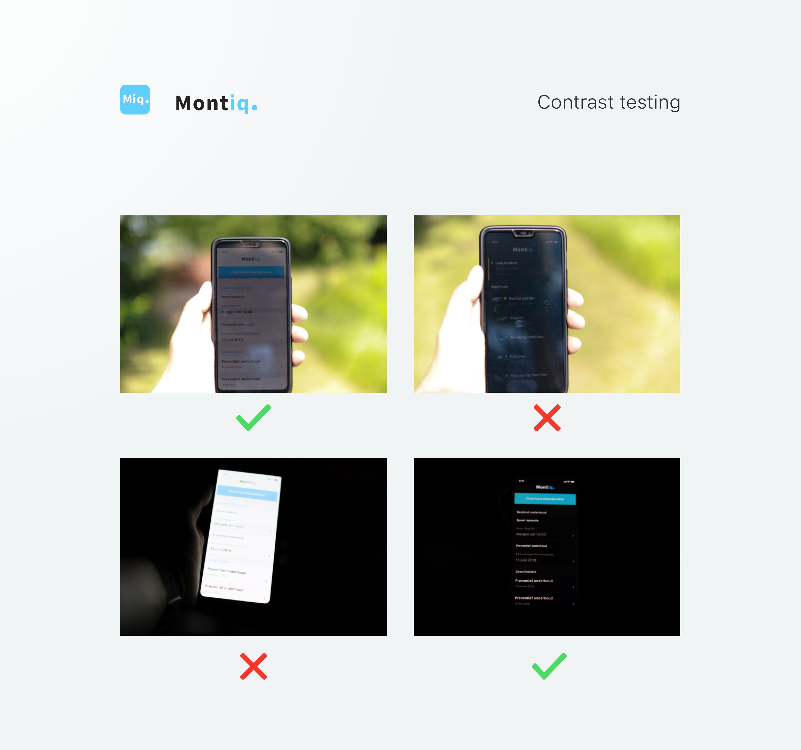

# Fase 1.6 - Feedback design

## Context

De boer zal de volgende situaties hebben tijdens hun werk, waarop ik mij wil focussen:

* Veel licht in omgeving.
* Weinig licht in omgeving.
* Snel \(belangrijke/huidige\) details zien. Ze hebben weinig tijd tijdens het werk.
* Uitgebreid data \(geschiedenis\) zien. Ze hebben tijd om na werk om conclusies te trekken uit de data.
* Veel geluid tijdens het werk.

### Contrast voor tegenlicht en weinig licht

> Dark text on light background is more widely used for better readability and focus during the day. \(Maltezou, 2018\)

> Match the user’s environment. As we’ve already learnt, bright light at night or in a dark environment is not the best option for our eyes. Hence we have to take into consideration, the user’s environment when an app is used. \(Maltezou, 2018\)

Ik heb gekozen om mijn app te ontwerpen in een Light UI. Ik bedoel hiermee een witte achtergrond en een zwarte typography. Met daarnaast een Dark UI. Ik bedoel hiermee een zwarte achtergrond met daarin witte typography. 

### Functies weergeven

> Considering the audience and their situation is probably the most important element of a successful design process. There are no universal solutions and the very definition of usefulness is based upon context. **What works for one problem does not necessarily solve another.** \(Morawski, 2018\)

Dit is per machine verschillend en ik kan daarom geen exacte waarde invullen in mijn ontwerp voor alle machines. Dit zou per machine moeten opnieuw worden beslist. Wel kan ik een element creëren die veranderd per machine. 

**De blogpost van Morawski heeft ook een vragenlijst om meer inzicht te krijgen van de context**

Q: Where will people use the product?  
A: De gebruiker heeft veel verschillende locaties waar hij het product kan gebruiken: Tijdens werk kan het verschillen tussen buiten met enorm veel licht tot donker in een koelcel. Daarnaast kan de druk tijdens het werk verschillen. . 

Q: Is the product to be used separately or as a part of a larger scheme? Perhaps it involves some type of group activity?  
A: Het wordt gebruikt in een groter geheel. Deze tool zal gebruikt worden door meerdere gebruikers en zal gecombineerd worden met andere communicatie-, operationele- en planning tools.

Q: How familiar are people with the overall concepts of a product? Could they’ve used something similar in the past?  
A: Op dit moment gebruiken mijn testpersonen de boordcomputers van de machines en kunnen sommige kunnen data al monitoren via een webapplicatie.

Q: How much time do they have? Are they laying on a couch, eating dinner with family, or running to an office during the rush hour?  
A:  De gebruiker moet of heel snel even kijken wat de status is van alle machines, of hij is op kantoor en kan met alle rust de data bekijken

Q: What kind of expectations do people have about the product? Do they hope to use it daily for years or just one or two times and quickly forget about it?  
A: Ik verwacht dat de applicatie per twee weken wordt gebruikt voor storingen, meldingen en uitschieters. Data kan wekelijks worden gebruikt. Afhankelijk van het productseizoen. 

Q: Do they feel sure about using the product? What can they be afraid of?  
A: Notificaties niet goed door geven, dus als er een storing is ze geen bericht krijgen.

Q: What kind of support can you offer them?  
A: Installeren van de machines en product. Ook bij het toevoegen van nieuwe machines. Deze installaties wordt momenteel al voor betaald en kan dit als extra service worden toevoegt van de machinefabrikant.

Q: Where do you see this product in a year?  
A: Ik zie dit project in een jaar als een ontwikkeld platform. Met verschillende machinefabrikanten als klant. Die deze applicatie leveren aan hun klanten. Ik denk ook dat er wordt gewerkt aan een toevoeging van het besturen van de machines naast het monitoren.

## Readability

### Contrast __

Ik zal in mijn volgend ontwerp gebruik maken van een witte achtergrond en zwarte typography voor een hoger contrast en daardoor betere leesbaarheid. 

Bij verandering van licht wil ik de applicatie een zwart achtergrond geven en witte tekst. Dit is prettiger voor de ogen van de gebruiker. Zie _Contrast voor tegenlicht  en weinig licht_ 

### Font

> Maintain a simple and clean UI and use fonts of that style is the key. You may choose a secondary font to make contrast with the primary one. In that case, 2 or 3 fonts is quite enough.

> U**se built-in text styles whenever possible**. The built-in text styles let you express content in ways that are visually distinct, while retaining optimal legibility. These styles are based on the system fonts and allow you to take advantage of key typographic features, such as Dynamic Type, which automatically adjusts tracking and leading for every font size.

> **Fontsizes**
>
> iOS minimaal hoger dan 11pt
>
> Android 14pt

Grotendeels van de app zal bestaan uit Built in text fonts. voor iOS is dat Sans fransico en Android is dat Roboto. Zo kan de gebruiker zijn teksten aanpassen en zijn gewent aan deze fonts. 

Ook zal ik in deze versie beter kijken naar de fontsize en zal deze ook testen.

## Bronnen

Maltezou, C. \(2018, June 15\). Dark or Light UI? The UX Influence. Retrieved May 31, 2019, from [https://uxdesign.cc/dark-or-light-ui-the-ux-influence-ca6df6aff390?gi=2376192f7ef9](https://uxdesign.cc/dark-or-light-ui-the-ux-influence-ca6df6aff390?gi=2376192f7ef9)

Morawski, J. \(2018, March 27\). On Function-Driven Design. Retrieved May 31, 2019, from [https://medium.com/@jmorawski/on-watches-ikea-furniture-function-driven-design-9d15d2358824](https://medium.com/@jmorawski/on-watches-ikea-furniture-function-driven-design-9d15d2358824)

Mockplus. \(2017, October 24\). Typography In Mobile Design — 15 Best Practices To Excellent UI. Retrieved May 31, 2019, from [https://www.mockplus.com/blog/post/typography-in-mobile-design](https://www.mockplus.com/blog/post/typography-in-mobile-design)

