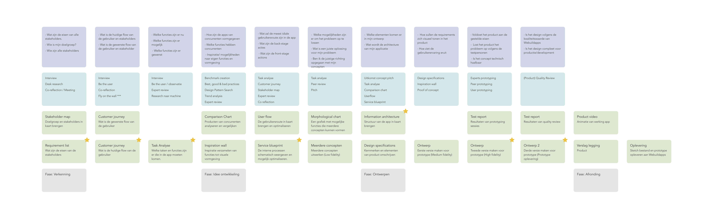
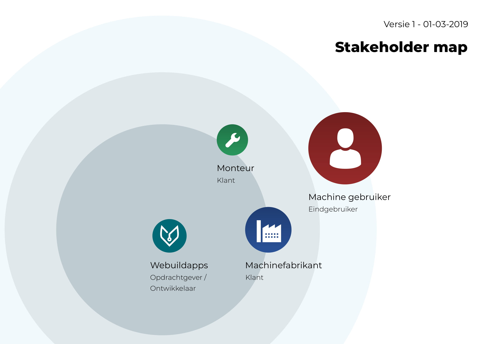

# Fase 1.1 - Markt

## Fase 1.1 - Stakeholders in kaart brengen en Requirements list opstellen

### Onderzoeksvragen

Ik heb de volgende onderzoeksvragen gesteld binnen deze fase:

1. Wat zijn de eisen van alle stakeholders
2. Wie zijn mijn stakeholders
3. Hoe ziet de markt eruit van mijn stakeholders

### Onderzoeksmethodes

Ik wil tijdens deze fase de volgende onderzoeksmethodes toepassen:

1. Interview met stakeholders
2. Deskresearch naar de markt
3. Meeting met de opdrachtgever en stakeholders

### Deliverables

1. Requirement list
2. Stakeholder map
3. SWOT Analyse

## Onderzoeksdata

### Briefing met opdrachtgever

Ontmoeting met de opdrachtgever hebben we besproken dat het product de volgende eisen moest bevatten: 

1. Applicatie waar mensen de status van hun machine kunnen zien. Zoals online of storingen.
2. De fabrikant en dealer moeten ook een rol krijgen binnen het platform zodat zij ook kunnen zien wanneer de machine storingen heb gehad.
3. Handleidingen, expoded view en tijdlijn met storingen
4. Hoevaak er onderhoud is uitgevoerd.
5. Welke storingen er zijn
6. Algemene data zoals: Draaiuren
7. Monteur kan een dossier bijhouden
8. Privacy instellingen, welke data er gedeeld wordt naar de machinefabrikant en welke informatie de gebruikers zien. 

Ook werden er problemen genoemd van hun klanten

1. Gebruiker van de machine heeft vraag naar monitoren op afstand.
2. Monteur niet weet wat voor storingen er zijn plaats gevonden.

### Gesprek met potentiële afnemers

Potentiële afnemers die ik gesproken zijn Allround Vegetable Processing en Allround Storage

**Notities uit het gesprek met Allround Vegetable Processing**

Allround Vegetable Processing is een bedrijf die machines fabriceert die groenten, fruit en aardappelen verwerken. Denk hierbij aan het schoonmaken tot het sorteren van de producten.  

Ik heb gesproken met Huib Smit de CEO van het bedrijf. 

1. Allround Vegetable Processing heeft met projecten vaak samenwerking met andere bedrijven. Al deze machines werken ook weer met elkaar samen. 
2. Deze groep bedrijven zijn  momenteel bezig met een digitalisering van hun proces bij grote projecten. Zij zien dat dit een wens in bij grotere projecten zoals distributiecentrums. Ook willen ze hier meer aftersales mee creëren zoals onderhoud. 
3. Allround Vegetable Processing heeft een heel groot schala aan machines. Al deze type machines worden bij productie ook nog eens aangepast op de wensen van de klant. Documentatie is daarom niet gedetailleerd omdat het vaak verschild.
4. Klanten vragen naar operationele data en kostenmetingen

Huib wou me graag helpen binnen dit project en stuurde mij door naar een partner bedrijf: Allround Storage.

**Notities uit het gesprek met Allround Storage**

Allround Storage is een bedrijf die koelcellen bouwt. Met koelcellen kan je producten langer bewaren om in te spelen op de markt. Hun focussen ook op de markt van groenten, fruit en aardappelen boeren. 

 Ik heb gesproken met Walter Breeschoten Commercial manager van Allround Vegetable Processing en Storage.

1. Allround Storage heeft momenteel al een web app om data weer te geven van de machines. Deze is echter verouderd en niet van hoge kwaliteit. Hierin kunnen gebruikers zien wat de status is van de machines. Data zien in grafieken en systeem instellingen toepassen.
2. Klanten vragen naar operationele data en kostenmetingen
3. Walter zou mij documentatie doorsturen van alle sensoren van de verschillende machines.
4. Het beheren van de juiste temperaturen is erg cruciaal voor de kwaliteit van de producten. Als het verkeerd gaat zou je veel geld kunnen verliezen. Daarom is het belangrijk dat de eigenaar direct te weten krijgt als er een fout is binnen het systeem.

### Planning

Ik heb een planning gemaakt voor mijn project.   
  
V1 is gemaakt voor mijn debriefing. In deze versie van mijn debriefing kreeg ik feedback dat ik mijn belangrijke opleveringen moest communiceren. 



V2 heeft sterretjes bij opleveringen die belangrijk zijn binnen mijn project. Zo weet ik waar ik mijn prioriteiten liggen binnen het project.



###  Designbrief









Mijn eerste versie van de affinity map. Ik heb deze gemaakt met inzichten die ik gemaakt hebt met mijn eerste deskresearch voor het maken van mijn designbrief



_Tweede versie van mijn Affinity map is te vinden in Fase 1.2_

### Stakeholder map

In deze map worden de stakeholder, ook wel de belanghebbende binnen het project weergegeven. Ook worden de relatie onderling aangegeven, dit omdat het vaak onduidelijk was voor de luisteraars van mijn verhaal.  

_Tweede versie van mijn Stakeholder map is te vinden in Fase 1.2_

### Deskresearch

Deskresearch met het doel om te kijken hoe de markt eruit ziet. 

Ik ben bij dit onderzoek de markt gaan verdelen tussen twee groepen: Productie en Analytisch. 

Bij productie moet je denken aan machines die in een productieproces werken. Een voorbeeld zijn boeren die machines hebben om hun producten te verwerken en op te slaan. 

Bij analytisch moet je denken aan machines die zelfstandig iets opleveren, vaak is dit stroom op wekken doormiddel van zonnepanelen of windmolens.





Tijdens het onderzoek kwam ik er achter dat de markt van productie veel meer potentie had binnen mijn project. De meeste producten van de analytische markt worden al \(vaak slecht\) software producten aangeboden. Ik zag meer uitdaging in de complexe markt van productie. Hier kan ik werken aan inzicht krijgen met kosten, afval, onderhoud en productiestilstand vermindering. 

## Inzichten

### Deskresearch markt productie

De inzichten uit  "deskresearch markt productie" 

#### Crodeon

1. Machines staan op een andere locatie dan waar de eigenaar zich bevind
2. Als er iets fout gaat is de wens van de machine eigenaar om dat direct te weten.
3. Wilt ook kunnen zien of de machine werkt zoals hij hoort te werken

#### KPN - Smart farming \(3 video's\)

1. Digitalisering vind plaats in de markt, omdat het niet bij te houden is op papier.
2. Dubbele vraag naar voedsel, de helft minder resources.
3. Internet of Things \(IoT\) is nodig bij afgelegen locaties om machines te laten communiceren met andere systemen.
4. Productie van een boer wordt te groot om hun productie waar te nemen doormiddel van menselijke zintuigen. Dit moet nu worden gedaan doormiddel van sensoren \(data driven werken\).
5. Data moet overal zichtbaar zijn.
6. Boeren werken met data om hun productie te vergroten en hun kwaliteit te verbeteren.
7. Opbrengstmeting is belangrijkst in farming.
8. Kunnen zien of \(nieuwe\) technologie en methodes ook het gewenste resultaat hebben geleverd.

#### Eaton - Voorkomen van slijtage

1. Productiestop levert verandering in de planningen en dit kan financiële problemen geven.
2. Boeren zijn sceptisch over nieuwe technieken
3. Met data kan je problemen visualiseren zodat ingenieurs op afstand aan het probleem kan werken.

### Deskresearch markt analyse

De inzichten uit "deskresearch markt analyse"

#### Energieleveranciers

1. Eenmaal na aankoop kijkt de koper nauwelijks meer naar de monitoringssystemen
2. Minder productie kan komen door schade
3. Minder productie kan komen door ouderdom
4. Minder productie kan komen door omgevingsfactoren \(schaduw en sneeuw\)
5. Minder productie kan komen door kwaliteit hardware
6. Wanneer je niet doorhebt dat je zonnepanelen minder goed presteren, scheelt het je op de lange termijn een behoorlijke hoeveelheid stroom

#### SunData

1. Het grootste doel van de zonnepanel eigenaren van deze machines is de investering terug te verdienen
2. Tweede doel van zonnepanelen eigenaren is duurzaamheid en het opleveren van eigenstroom. 

#### Windpowerengineering

1. Het doel van monitoring is het voorspellen van onderhoudsproblemen.

#### iLika - Wind turbine monitoring

1. Onderhoud bij windmolens is cruciaal voor het behouden van optimale resultaten.
2. Eigenaren willen productiekosten zien om overzicht te hebben op de investering.
3. Technische mensen, middelen en transport is duur. Het is belangrijk om kleine reparaties uit te voeren in plaats van onderdelen te moeten vervangen.

### Marktanalyse


**Onderzoeksvraag 3: Hoe ziet de markt eruit van mijn stakeholders?**


#### Productie

#### Analyse

### Stakeholders


**Onderzoeksvraag 2: Wie zijn de stakeholders**


Het is nu duidelijk in de Stakeholder map wie mijn belanghebbende zijn.

**In de gesprekken van de potentiële afnemers kwam naar voren dat:**

1. Er is vraag naar digitaliseren bij hun klanten.
2. Er vraag is naar Preventief onderhoud
3. Ze hebben zelf ook ruimte om hierin te investeren qua geld en tijd.
4. Ze zijn er al mee bezig. Uitwerking is nog niet perfect in mijn ogen.

**In het gesprek van mijn opdrachtgever kwam naar voren dat:**

1. Veel kennis in development.
2. Nog geen duidelijk beeld voor ogen, maar willen door onderzoek designkeuzen creëren. 
3. Zouden graag met dit project werken met de technologie IoT.

### Requirements list


**Onderzoeksvraag 1: Wat zijn de eisen van alle stakeholders?** 




### Affinity map



