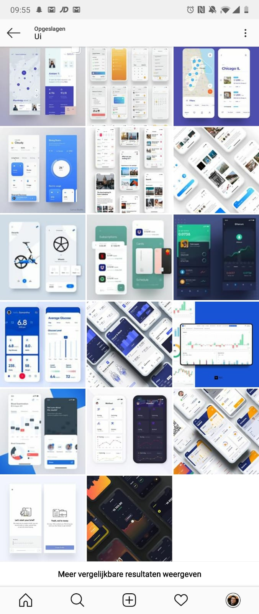

# Fase 2.1 - Inspiratie

## Fase 2.1 - Inspiratie en idee ontwikkelen

### Onderzoeksvragen

Ik heb de volgende onderzoeksvragen gesteld binnen deze fase:

1. Welke functies moet de UI bevatten
2. Inspiratie branding
3. Hoe zijn de concurrerende apps ontworpen

### Onderzoeksmethodes

Ik wil tijdens deze fase de volgende onderzoeksmethodes toepassen:

1. Benchmark creations
2. Best, good & Bad practices
3. Design Pattern search
4. Trends analysis
5. Expert review

### Deliverables

Inspiration wall

## Productbiografie F2.1

### Eerste benchmark

Ik ben op het internet rond gaan kijken hoe andere designers app ontwerpen voor het weergeven van data en het instellen van verschillende opties van producten/diensten/machines.



### Eerste schetsen

De eerste schetsen heb ik getekend op school, door nauw samen te brainstormen met een andere CMD student. Dit heb ik gedaan door mijn Benchmark ernaast te houden. Deze schetsen heb ik vervolgens zelf weer digitaal getekend voor de presentatie: Feedback Frenzy. Om zo beter de schermen te presenteren.



### Inspiration wall

Inspiration walls heb ik op socialmedia en designer platforms bijgehouden:

* Instagram \(opgeslagen berichten\) Denk aan profielen als: @uiuxsupply @ui8net @uxflavors
* Dribble \(Buckets\) [https://dribbble.com/pieterdekroon/buckets/1120543-Project-Monitoring](https://dribbble.com/pieterdekroon/buckets/1120543-Project-Monitoring)

### Benchmark

