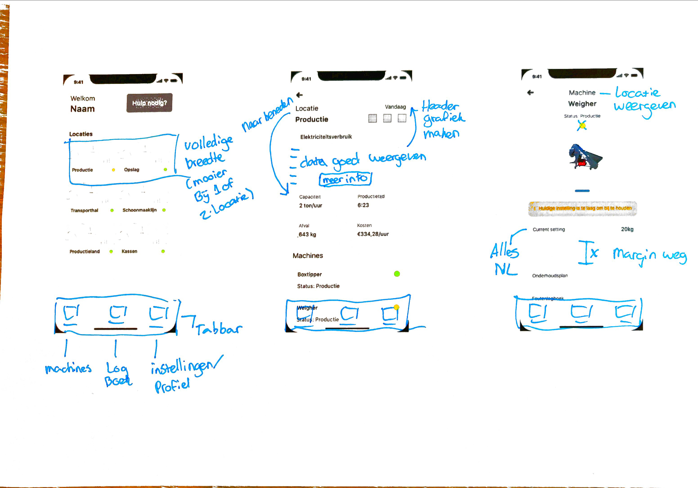
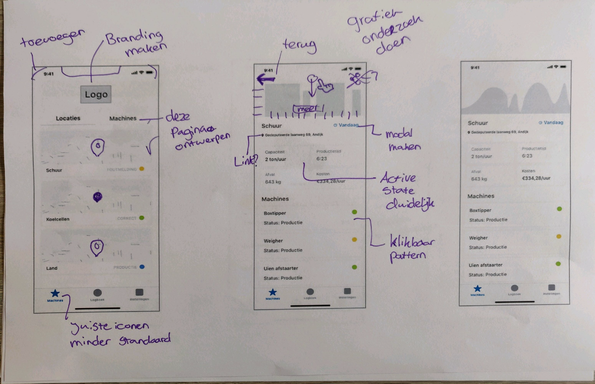
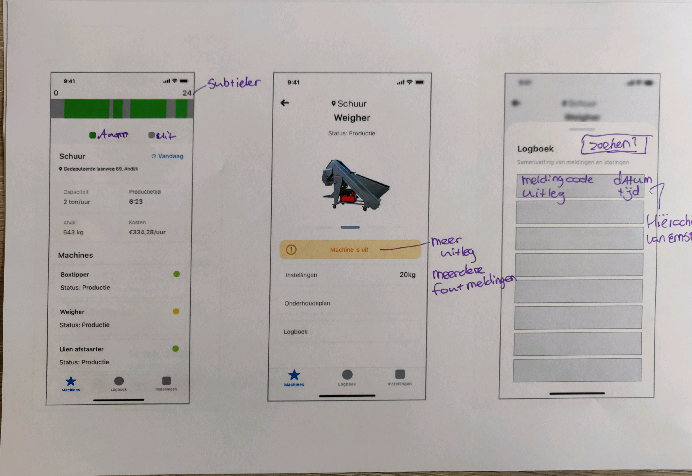
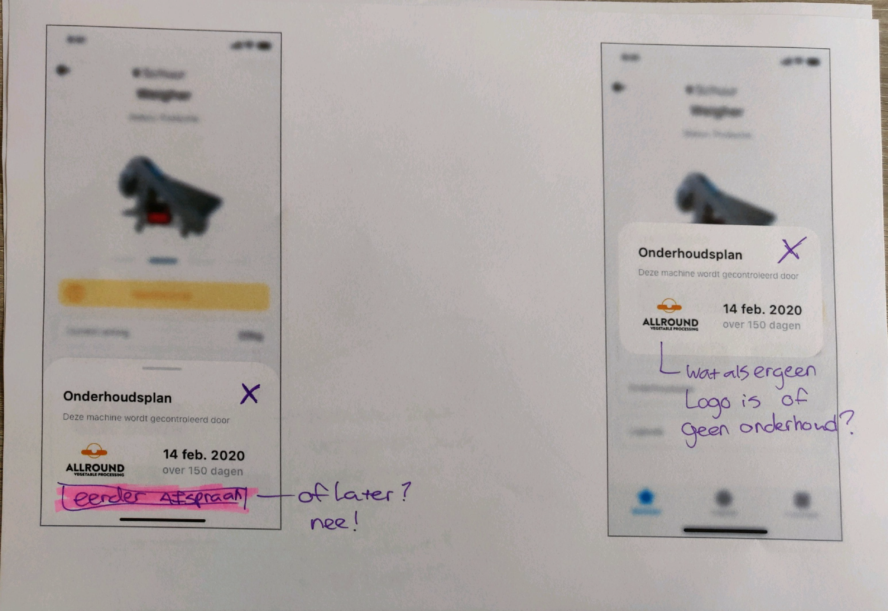
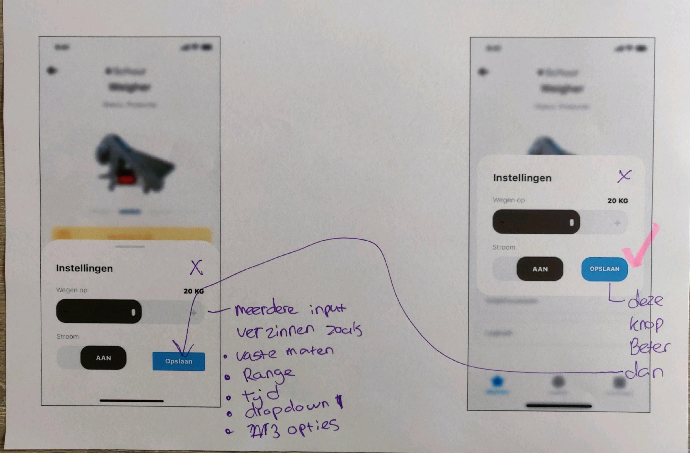
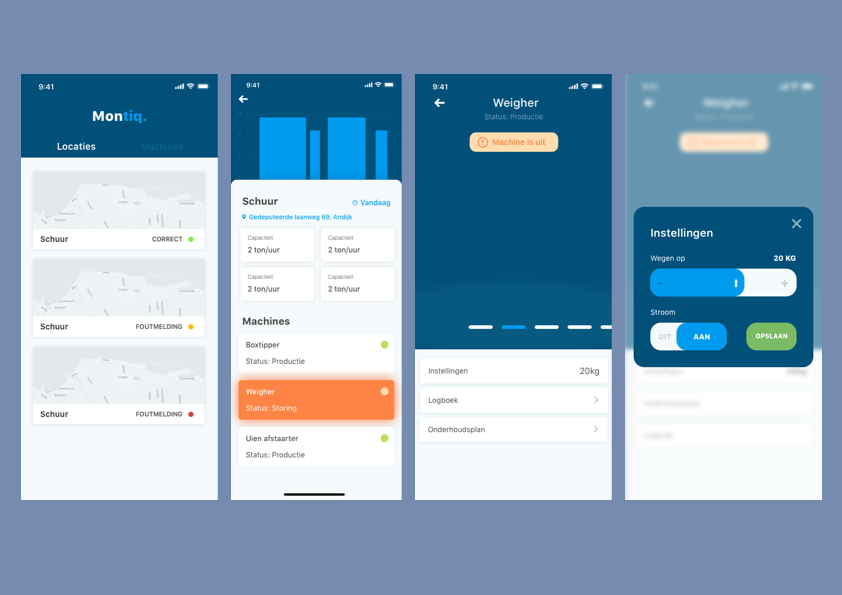

# Fase 2.2 - Eerdere prototypes

## Digitale schetsen

Doorgenomen met een CMD student \(Jamie meester\)

### 

## Verbetering op de feedback

Doorgenomen met Webuildapps.

### Begin aan Prototype

### Design rationale ideeen 1.0



