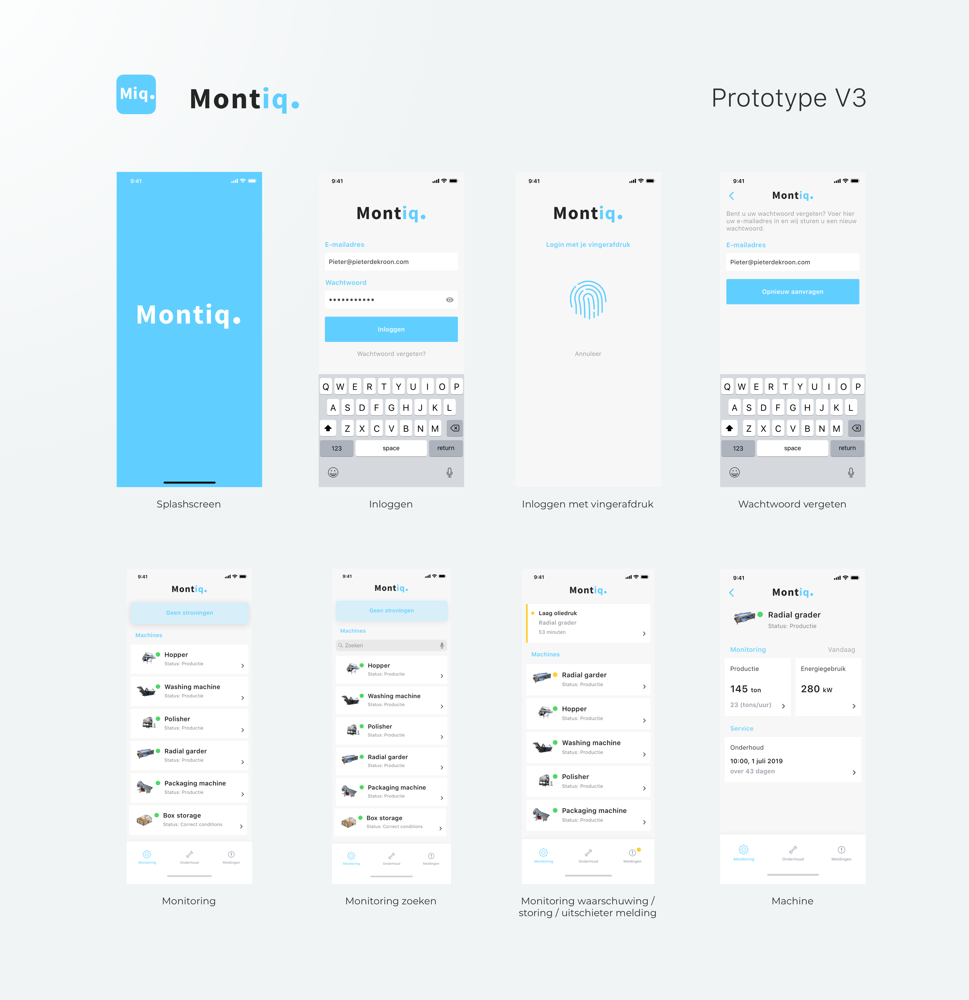
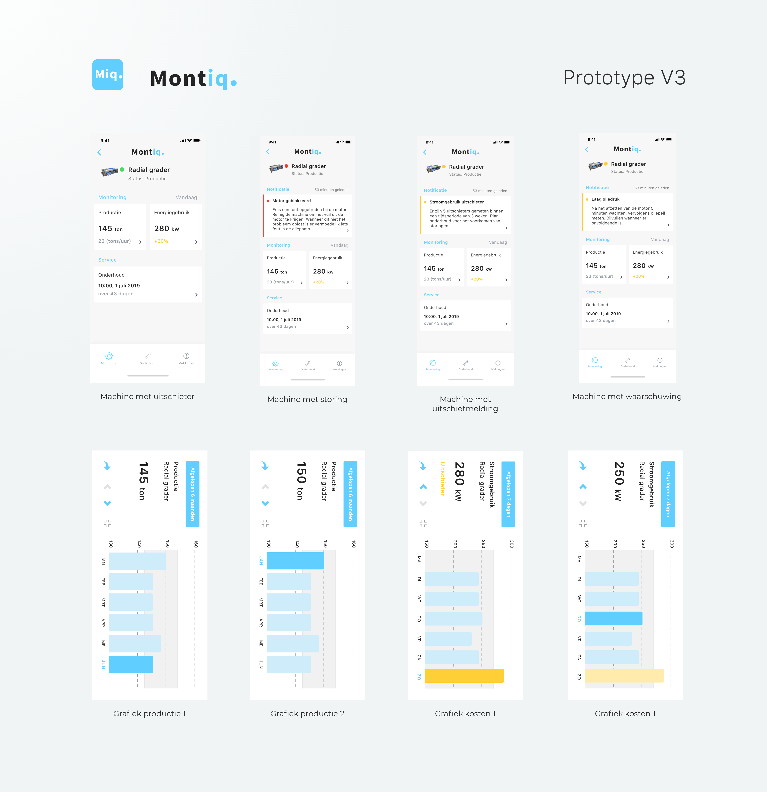
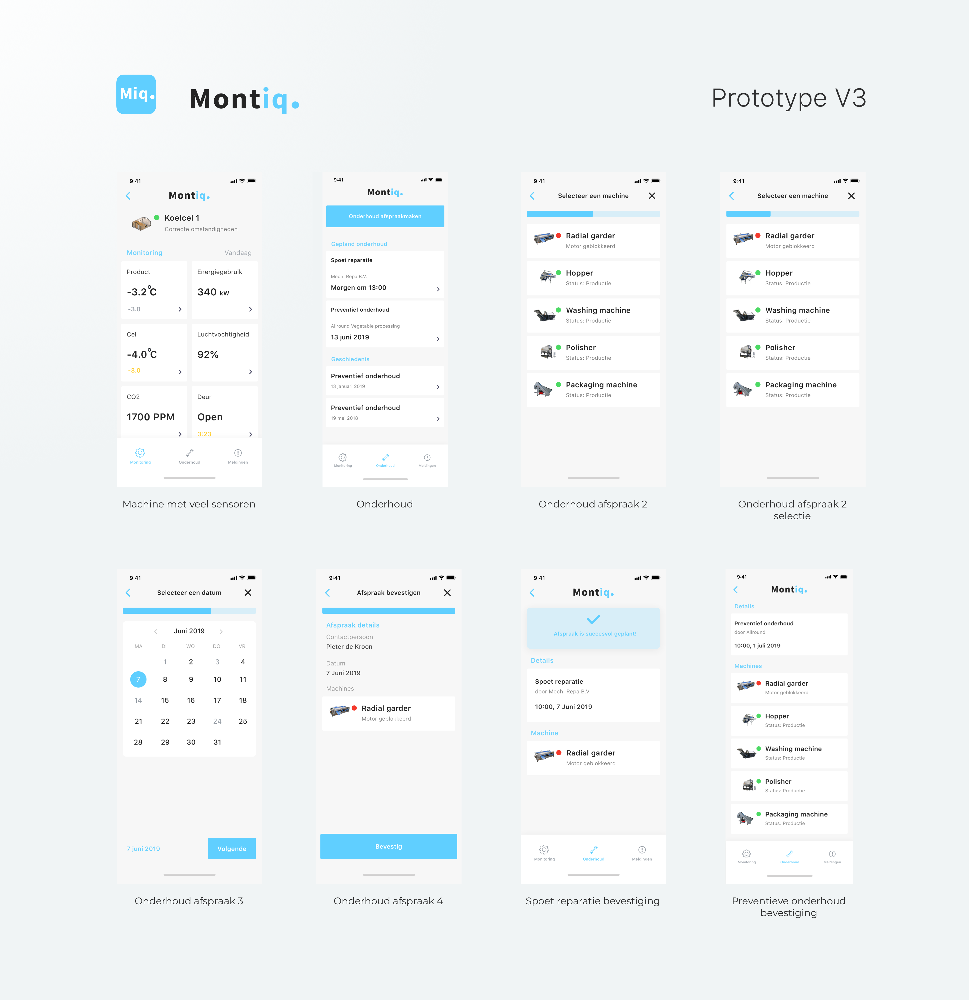
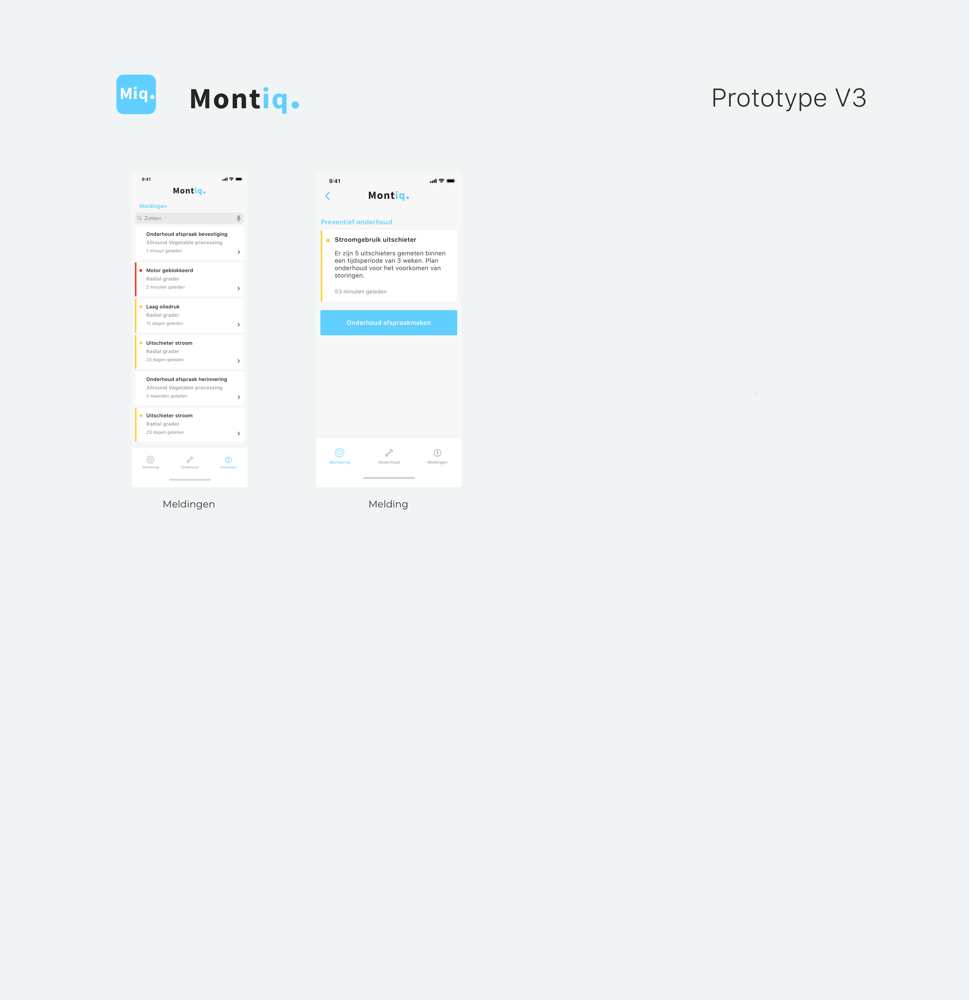
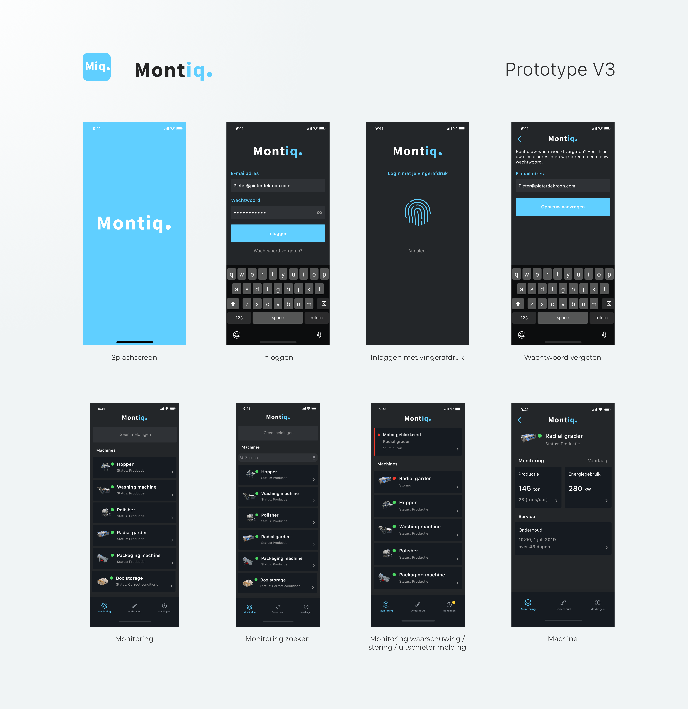
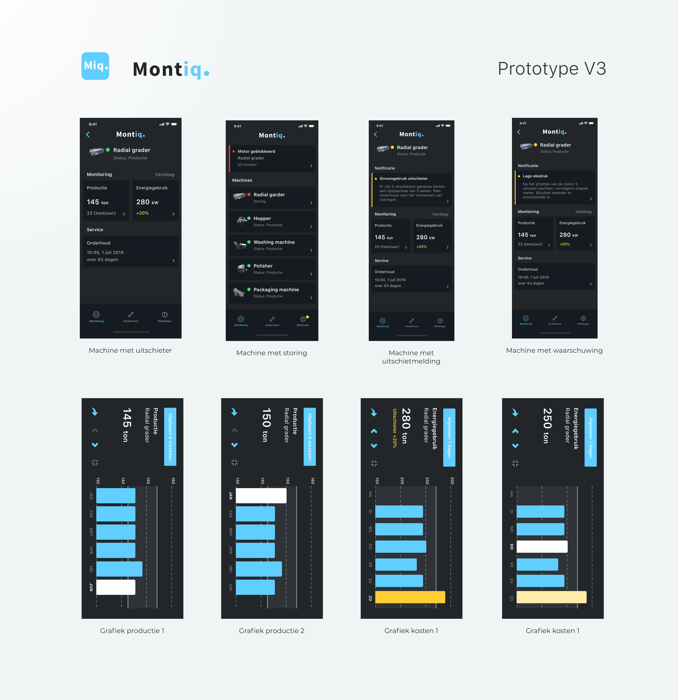
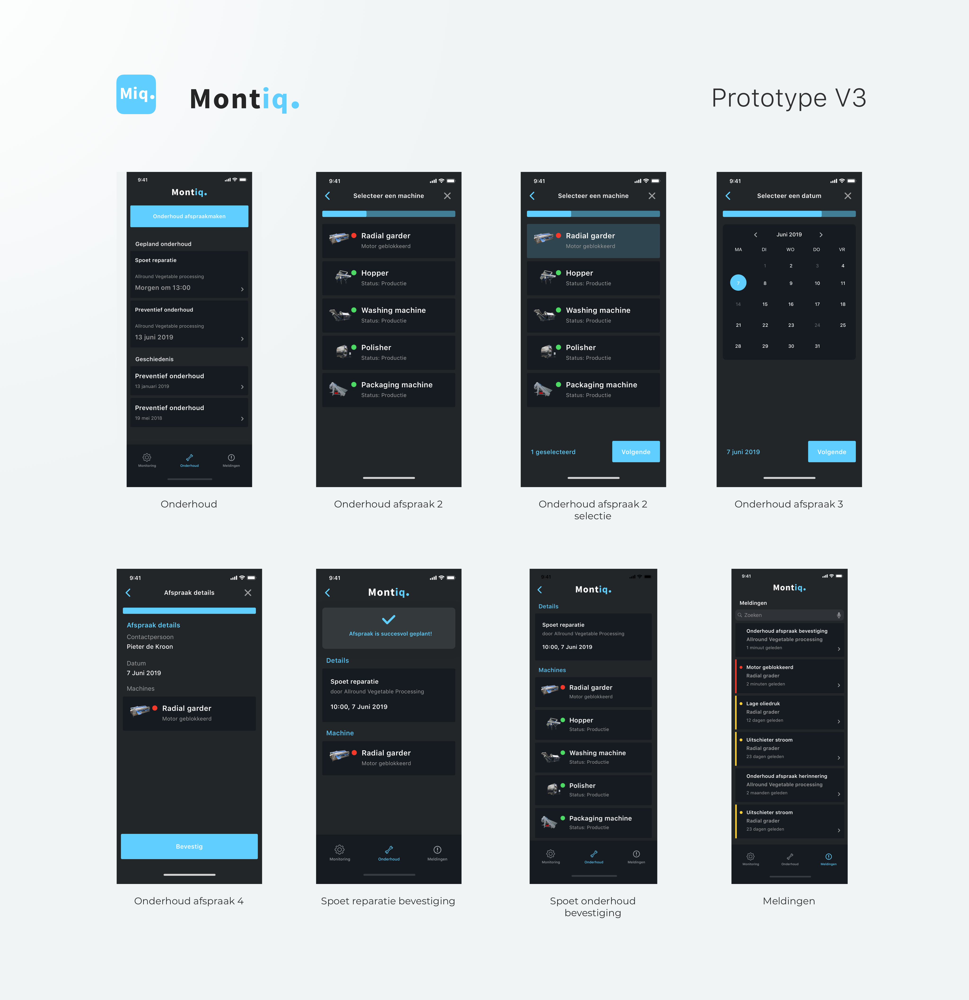
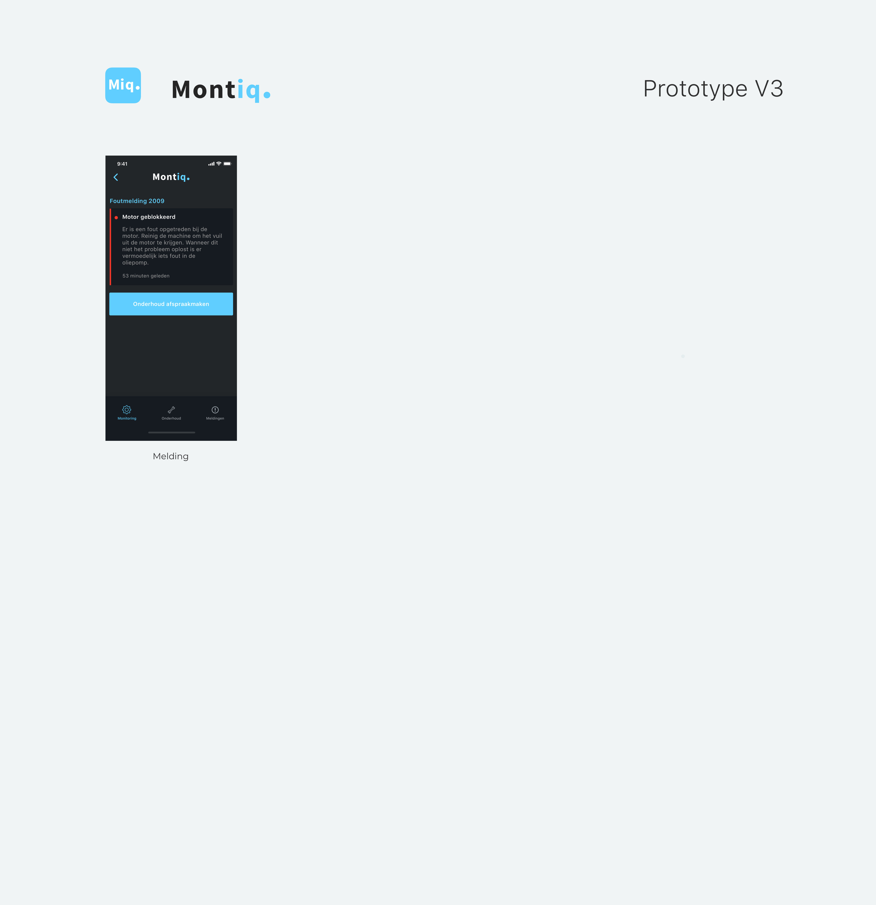

# Fase 3.4 - Prototype V3

## Veranderingen in V3

### Toegevoegd

* First element bij afspraak bevestiging
* Voorbeeld van een koelcel; met meerdere data vlakken 

### Aangepast

* Geen meldingen is veranderd naar Geen storingen
* Kleur van geen meldingen is blauw geworden en valt nu meer op
* Afspraak maken: selectie merk is weggehaald.
* Afspraak maken heeft nu 3 stappen ipv 4
* Navigatie van grafiek gebruiksvriendelijker gemaakt door pijltjes grijs te maken als je niet verder kan navigeren.
* Tekstueel: Kosten &gt; Energiegebruik
* Menu icons aangepast.

## Prototypes

### Perfecte scenario

[https://sketch.cloud/s/GzybE/a/GGn52w/play](https://sketch.cloud/s/GzybE/a/GGn52w/play)

### Uitschiet scenario

[https://sketch.cloud/s/GzybE/a/jOpWko/play](https://sketch.cloud/s/GzybE/a/jOpWko/play)

### Storing scenario

[https://sketch.cloud/s/GzybE/a/0z0oZ2/play](
https://sketch.cloud/s/GzybE/a/0z0oZ2/play)

## Light UI

## 

## DarkUI

